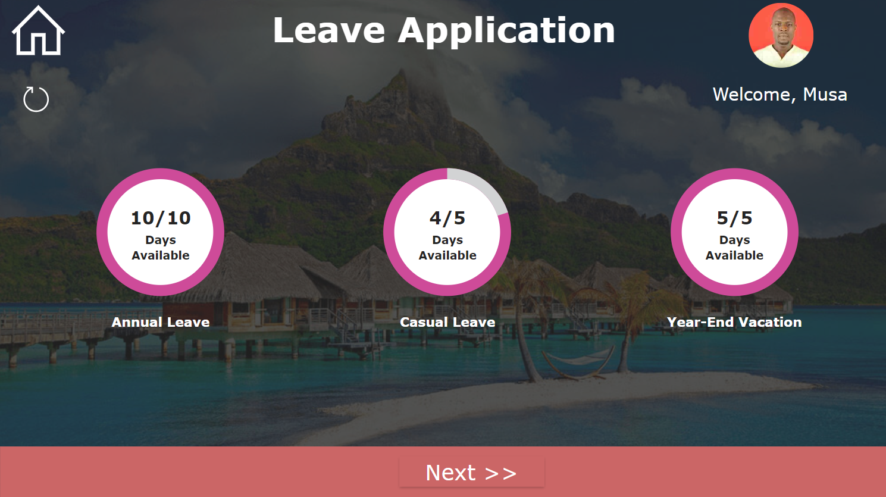
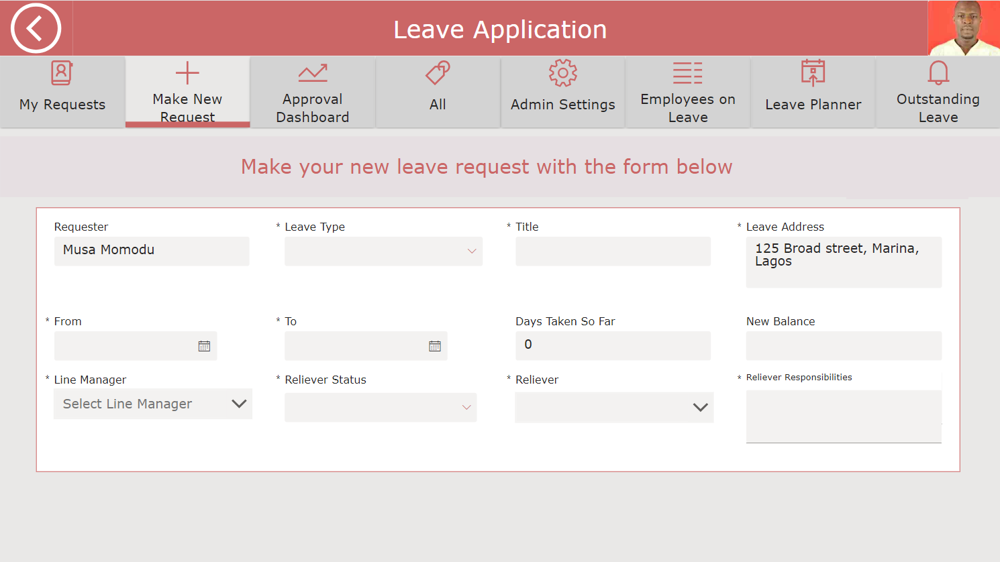
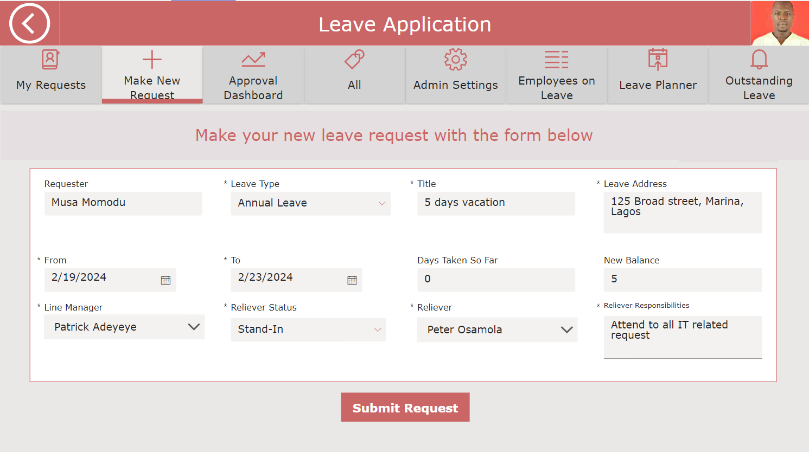
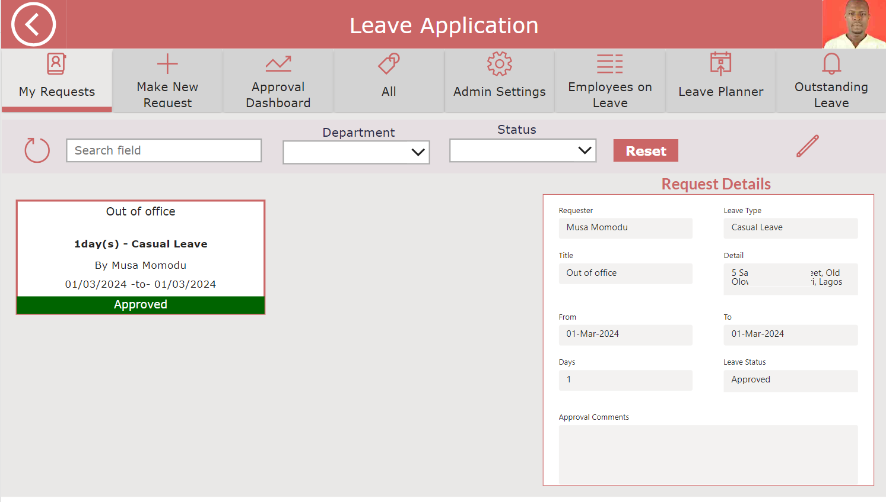
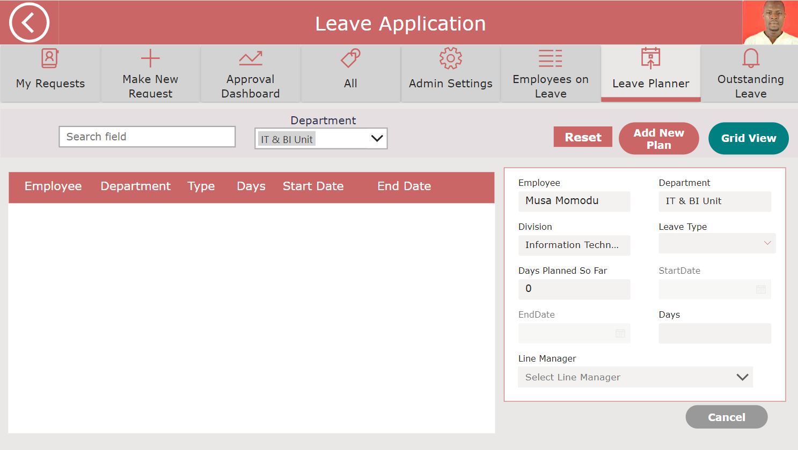

# Leave-Management-Application

## 1. Introduction

### 1.1 Overview
The Leave Management Application, powered by the Microsoft Power Platform, streamlines and automates leave-related processes within the organization. It facilitates leave request submission, approval workflows, and leave planning, while also providing real-time leave balance previews, timely notifications, and robust security measures. This comprehensive suite of features ensures operational efficiency and fosters a secure and collaborative environment.
### 1.2 Key Features
- **Leave Request Submission and Approval Workflows**: Employees can easily submit leave requests, and the system automates the approval process, ensuring efficient handling of leave applications.
- **Leave Planner**: The application provides tools for planning and managing leave, allowing employees to schedule time off effectively.
- **Real-Time Leave Balance Previews**: Employees can view their current leave balances in real time, helping them make informed decisions when requesting time off.
- **Timely Notifications**: The system sends notifications to relevant parties (such as managers and employees) at various stages of the leave process, ensuring everyone stays informed.
- **Record of Requests**: A comprehensive record of all leave requests is maintained, making it easy to track and manage leave history.
- **Leave Analytics**: Organizations can analyze leave patterns, trends, and usage, which can inform resource planning and policy adjustments.
- **Robust Security Protocols**: The application ensures data security and access control, safeguarding sensitive leave-related information.

# 2.0 Details
## 2.1 Skill Demonstrated
- Database:The application’s data structure relies on Microsoft Dataverse Tables for organizing data, establishing relationships, and connecting to the app.
Alternatively, SharePoint or SQL Server can serve the same purpose, but consistent field name maintenance is essential.
- PowerApps: We utilize PowerApps to design a customized user interface.
Its adaptable design features allow us to create intuitive and personalized experiences for end-users.
- Power Automate: Implemented to optimize and automate approval procedures within the application development framework.
It enhances workflow administration and promotes collaboration among team members.
- Power BI: Employed for crafting visual representations that provide deep insights and analytical perspectives.
These insights cover various aspects of documents, including usage patterns, access history, and performance metrics. 

### 2.2 User Roles and Controls
Three distinct roles have been delineated within the application: super admin, editor, and viewer.
- Super Admin: The super admin possesses extensive privileges, allowing them to create, update, read, and delete not only their own record but also all accessible records throughout the application.
- Editor: Editors can create, edit, and update their own records.
- Viewer: Viewers have limited access and can only browse records for which they have explicit permission.

## 3. App Interface

### 3.1 Main Page

### 3.2 Leave Management

#### 3.2.1 Leave Request Submission

Fresh Page | Completed Page
:------------------:|:---------------------:
   | 

### 3.3 Approved Leave

### 3.4 Planned Leave

